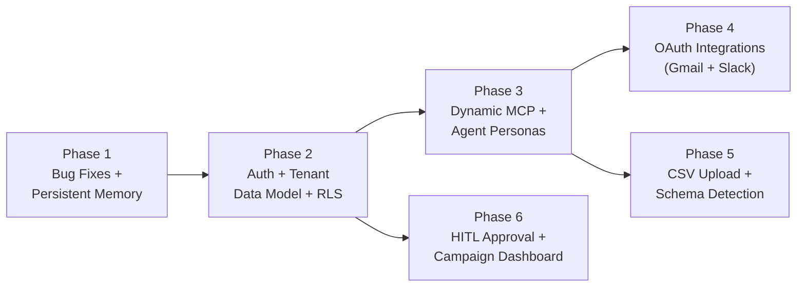

# BandhanAI Multi-Tenant Upgrade — Implementation Plan

## Goal

Transform BandhanAI from a single-tenant prototype into a multi-tenant SaaS platform where each business owner gets isolated data, integrations, agent personas, and conversation history.

---

## Phased Execution Order

The 11 features are grouped into **6 phases** based on dependency chains. Each phase builds on what was completed before it.



| Phase | Features | Depends On |
|-------|----------|------------|
| **1** | Bug Fixes (#10), Persistent Memory (#8) | Nothing |
| **2** | Auth (#1), Tenant Data Model + RLS (#2) | Phase 1 |
| **3** | Dynamic MCP Config (#4), Agent Personas (#7) | Phase 2 |
| **4** | Gmail OAuth (#5), Slack OAuth (#6) | Phase 3 |
| **5** | CSV Upload + Schema Detection (#3) | Phase 3 |
| **6** | HITL Approval UI (#9), Campaign Dashboard (#11) | Phase 2 |

---

## New Dependencies to Install

```
# Phase 1
langgraph-checkpoint-postgres>=2.0.0
psycopg[binary]>=3.1.0
psycopg-pool>=3.2.0

# Phase 2
PyJWT>=2.8.0
supabase>=2.0.0

# Phase 3 (no new deps)

# Phase 4
google-auth>=2.29.0
google-auth-oauthlib>=1.2.0
google-api-python-client>=2.130.0
slack-sdk>=3.27.0

# Phase 5 (no new deps — uses existing pandas + LLM)

# All phases
cryptography>=42.0.0
```

---

## New File Map

After all phases, the project structure becomes:

```
BandhanAI/
├── auth.py                  [NEW] JWT validation, signup/login helpers
├── config.py                [MODIFY] Add build_mcp_config_for_tenant()
├── encryption.py            [NEW] Fernet encrypt/decrypt for OAuth tokens
├── example_env              [MODIFY] Add new env vars
├── example_mcp_config.json  (unchanged — kept as reference)
├── frontend.py              [MODIFY] Auth middleware, tenant scoping, HITL modal support
├── graph.py                 [MODIFY] Accept tenant config, use PostgresSaver
├── langgraph.json           [MODIFY] Fix file reference
├── main.py                  [MODIFY] yolo_mode default, minor updates
├── migrations/
│   ├── 001_tenants.sql      [NEW] tenants + integrations tables
│   ├── 002_add_org_id.sql   [NEW] Add org_id to existing tables + RLS
│   └── 003_customers.sql    [NEW] JSONB customers table
├── oauth.py                 [NEW] Gmail + Slack OAuth flow handlers
├── prompts.py               [MODIFY] Dynamic prompt builder function
├── requirements.txt         [MODIFY] New dependencies
├── pyproject.toml           [MODIFY] New dependencies
├── server.py                [MODIFY] Scope queries by org_id
├── static/                  [NEW] Empty dir (placeholder)
└── upload.py                [NEW] CSV upload + LLM schema detection
```

---

## Phase 1: Bug Fixes + Persistent Memory

*Features: #10 (Bug Fixes), #8 (Persistent Memory)*

### Why first

Bug fixes prevent crashes. Persistent memory (`PostgresSaver`) sets up the Postgres checkpoint tables that all future phases will rely on, and proves the Supabase connection works at the async level with `psycopg` v3.

---

### Feature 10 — Bug Fixes

#### [MODIFY] [langgraph.json](file:///c:/Users/Musharraf/Documents/BandhanAI/BandhanAI/langgraph.json)

Fix the graph file reference:

```diff
  "graphs": {
-    "ralph_agent": "./new-graph.py:build_graph"
+    "ralph_agent": "./graph.py:build_graph"
  },
```

#### [MODIFY] [frontend.py](file:///c:/Users/Musharraf/Documents/BandhanAI/BandhanAI/frontend.py)

**Bug 2** — Fix uvicorn module name (line 331):

```diff
  uvicorn.run(
-     "server:app",
+     "frontend:app",
      host="0.0.0.0",
```

**Bug 3** — Guard the static mount (line 324):

```diff
- app.mount("/static", StaticFiles(directory="static"), name="static")
+ static_dir = Path(__file__).parent / "static"
+ if static_dir.exists():
+     app.mount("/static", StaticFiles(directory=str(static_dir)), name="static")
```

#### [NEW] `static/` directory

Create an empty `static/` directory with a `.gitkeep` file.

---

### Feature 8 — Persistent Conversation Memory

#### [MODIFY] [graph.py](file:///c:/Users/Musharraf/Documents/BandhanAI/BandhanAI/graph.py)

Replace `MemorySaver` with `AsyncPostgresSaver`:

```diff
- from langgraph.checkpoint.memory import MemorySaver
+ from langgraph.checkpoint.postgres.aio import AsyncPostgresSaver
+ from psycopg_pool import AsyncConnectionPool
+ from psycopg.rows import dict_row
+ import os
```

Change `build_graph()` signature and body:

```diff
- async def build_graph():
+ async def build_graph(checkpointer=None, mcp_config_override=None):
      """
      Build the LangGraph application.
      """
-     client = MultiServerMCPClient(connections=mcp_config["mcpServers"])
+     from config import mcp_config
+     active_config = mcp_config_override or mcp_config
+     client = MultiServerMCPClient(connections=active_config["mcpServers"])
      tools = await client.get_tools()
      ...
-     return builder.compile(checkpointer=MemorySaver())
+     if checkpointer is None:
+         checkpointer = MemorySaver()
+     return builder.compile(checkpointer=checkpointer)
```

> [!NOTE]
> We keep `MemorySaver` as a fallback for local dev/CLI mode. The `frontend.py` session initialization will pass the `AsyncPostgresSaver`.

Remove the module-level `from config import mcp_config` import at the top of the file, since we now import it lazily inside `build_graph()`.

#### [MODIFY] [frontend.py](file:///c:/Users/Musharraf/Documents/BandhanAI/BandhanAI/frontend.py)

Add checkpointer initialization at app startup:

```python
from langgraph.checkpoint.postgres.aio import AsyncPostgresSaver
from psycopg_pool import AsyncConnectionPool
from psycopg.rows import dict_row

# Module-level pool (initialized on startup)
pg_pool: AsyncConnectionPool = None
checkpointer: AsyncPostgresSaver = None

@app.on_event("startup")
async def startup():
    global pg_pool, checkpointer
    pg_pool = AsyncConnectionPool(
        conninfo=os.getenv("SUPABASE_URI"),
        kwargs={"autocommit": True, "row_factory": dict_row},
        open=True
    )
    checkpointer = AsyncPostgresSaver(pg_pool)
    await checkpointer.setup()

@app.on_event("shutdown")
async def shutdown():
    global pg_pool
    if pg_pool:
        await pg_pool.close()
```

Update `ConnectionManager.connect()` to pass the shared checkpointer:

```diff
  self.agent_sessions[session_id] = {
-     "graph": await build_graph(),
+     "graph": await build_graph(checkpointer=checkpointer),
      "config": {
-         "configurable": {"thread_id": session_id},
+         "configurable": {"thread_id": session_id},  # will become org_id:session_id in Phase 2
```

#### [MODIFY] [requirements.txt](file:///c:/Users/Musharraf/Documents/BandhanAI/BandhanAI/requirements.txt) & [pyproject.toml](file:///c:/Users/Musharraf/Documents/BandhanAI/BandhanAI/pyproject.toml)

Add:
```
langgraph-checkpoint-postgres>=2.0.0
psycopg[binary]>=3.1.0
psycopg-pool>=3.2.0
```

#### [MODIFY] [example_env](file:///c:/Users/Musharraf/Documents/BandhanAI/BandhanAI/example_env)

No changes needed — `SUPABASE_URI` already exists.

### Phase 1 Verification

- [ ] `python main.py` starts without crash (bug fixes confirmed)
- [ ] `python frontend.py` starts without crash (uvicorn + static mount)
- [ ] LangGraph checkpoint tables auto-created in Supabase
- [ ] Conversation persists across WebSocket reconnects (same session_id)

---

## Phase 2: Auth + Tenant Data Model + RLS

*Features: #1 (Auth), #2 (Tenant Data Model + RLS)*

### Why second

Everything from Phase 3 onward needs an `org_id` to scope against. Auth creates the identity, the tenant model stores it, RLS enforces it.

---

### Database Migrations

#### [NEW] `migrations/001_tenants.sql`

```sql
-- Master tenant record
CREATE TABLE public.tenants (
    org_id UUID PRIMARY KEY DEFAULT gen_random_uuid(),
    owner_email TEXT NOT NULL UNIQUE,
    owner_auth_uid UUID NOT NULL UNIQUE,  -- maps to Supabase auth.users.id
    org_name TEXT NOT NULL,
    agent_name TEXT DEFAULT 'Ralph',
    backstory TEXT,
    tone_instructions TEXT,
    schema_def JSONB,                      -- from CSV upload (Phase 5)
    created_at TIMESTAMP DEFAULT now()
);

-- Integration credentials (encrypted)
CREATE TABLE public.integrations (
    id UUID PRIMARY KEY DEFAULT gen_random_uuid(),
    org_id UUID NOT NULL UNIQUE REFERENCES public.tenants(org_id) ON DELETE CASCADE,
    gmail_access_token TEXT,    -- Fernet-encrypted
    gmail_refresh_token TEXT,   -- Fernet-encrypted
    gmail_token_expiry TIMESTAMP,
    slack_bot_token TEXT,       -- Fernet-encrypted
    slack_team_id TEXT,
    connected_at TIMESTAMP DEFAULT now()
);

-- RLS for tenants: owner can only see their own row
ALTER TABLE public.tenants ENABLE ROW LEVEL SECURITY;
CREATE POLICY tenants_owner_policy ON public.tenants
    FOR ALL USING (owner_auth_uid = auth.uid());

ALTER TABLE public.integrations ENABLE ROW LEVEL SECURITY;
CREATE POLICY integrations_owner_policy ON public.integrations
    FOR ALL USING (org_id IN (SELECT org_id FROM tenants WHERE owner_auth_uid = auth.uid()));
```

#### [NEW] `migrations/002_add_org_id.sql`

```sql
-- Add org_id to existing tables
ALTER TABLE public.crm ADD COLUMN org_id UUID NOT NULL REFERENCES public.tenants(org_id);
ALTER TABLE public.marketing_campaigns ADD COLUMN org_id UUID NOT NULL REFERENCES public.tenants(org_id);
ALTER TABLE public.campaigning_emails ADD COLUMN org_id UUID NOT NULL REFERENCES public.tenants(org_id);

-- Create indexes for performance
CREATE INDEX idx_crm_org_id ON public.crm(org_id);
CREATE INDEX idx_campaigns_org_id ON public.marketing_campaigns(org_id);
CREATE INDEX idx_emails_org_id ON public.campaigning_emails(org_id);

-- Enable RLS and create policies
ALTER TABLE public.crm ENABLE ROW LEVEL SECURITY;
CREATE POLICY crm_tenant_policy ON public.crm
    FOR ALL USING (org_id IN (SELECT org_id FROM tenants WHERE owner_auth_uid = auth.uid()));

ALTER TABLE public.marketing_campaigns ENABLE ROW LEVEL SECURITY;
CREATE POLICY campaigns_tenant_policy ON public.marketing_campaigns
    FOR ALL USING (org_id IN (SELECT org_id FROM tenants WHERE owner_auth_uid = auth.uid()));

ALTER TABLE public.campaigning_emails ENABLE ROW LEVEL SECURITY;
CREATE POLICY emails_tenant_policy ON public.campaigning_emails
    FOR ALL USING (org_id IN (SELECT org_id FROM tenants WHERE owner_auth_uid = auth.uid()));
```

> [!IMPORTANT]
> **Migration strategy for existing data:** The `ALTER TABLE ... ADD COLUMN org_id UUID NOT NULL` will fail if data already exists. Options:
> 1. **If dev/empty DB**: Run as-is.
> 2. **If existing data**: Add column as nullable first, backfill with a default tenant, then set `NOT NULL`.
>
> Which approach should we use?

---

### Feature 1 — Auth Layer

#### [NEW] `auth.py`

Core responsibilities:
- JWT validation via `PyJWT` using Supabase JWT secret (local decode, no network call)
- FastAPI dependency `get_current_user()` for REST endpoints
- WebSocket token extraction from query params (WebSocket doesn't support headers in browser)
- Helper to extract `org_id` from validated user payload

```python
"""
Authentication module — Supabase JWT validation.
"""
import jwt
from fastapi import Depends, HTTPException, WebSocket, status, Query
from fastapi.security import HTTPAuthorizationCredentials, HTTPBearer
import os

SUPABASE_JWT_SECRET = os.getenv("SUPABASE_JWT_SECRET")

security = HTTPBearer()

def get_current_user(cred: HTTPAuthorizationCredentials = Depends(security)) -> dict:
    """Validate JWT for REST endpoints. Returns decoded payload."""
    try:
        payload = jwt.decode(
            cred.credentials,
            SUPABASE_JWT_SECRET,
            audience="authenticated",
            algorithms=["HS256"],
        )
        return payload
    except jwt.PyJWTError:
        raise HTTPException(
            status_code=status.HTTP_401_UNAUTHORIZED,
            detail="Invalid or expired token"
        )

async def get_ws_user(websocket: WebSocket, token: str = Query(...)) -> dict:
    """Validate JWT for WebSocket connections (token in query param)."""
    try:
        payload = jwt.decode(
            token,
            SUPABASE_JWT_SECRET,
            audience="authenticated",
            algorithms=["HS256"],
        )
        return payload
    except jwt.PyJWTError:
        await websocket.close(code=4001, reason="Invalid token")
        raise HTTPException(status_code=401, detail="Invalid token")

async def get_org_id_for_user(auth_uid: str) -> str:
    """Look up the org_id for a given Supabase auth UID from the tenants table."""
    # Uses the shared pg_pool from frontend.py
    # Returns org_id string or raises 404
    ...
```

> [!NOTE]
> **Signup/login happen on the frontend via Supabase JS client.** The backend only validates tokens. We do NOT implement signup/login endpoints server-side — Supabase Auth handles that entirely client-side. The backend needs one POST endpoint `/auth/register-tenant` that, after validating the JWT, creates the `tenants` row.

#### [MODIFY] [frontend.py](file:///c:/Users/Musharraf/Documents/BandhanAI/BandhanAI/frontend.py)

**WebSocket auth gating:**

```diff
  @app.websocket("/ws/{session_id}")
- async def websocket_endpoint(websocket: WebSocket, session_id: str):
-     await manager.connect(websocket, session_id)
+ async def websocket_endpoint(websocket: WebSocket, session_id: str, token: str = Query(...)):
+     user = await get_ws_user(websocket, token)
+     org_id = await get_org_id_for_user(user["sub"])
+     await manager.connect(websocket, session_id, org_id)
```

**Scope thread_id to tenant:**

```diff
  "config": {
-     "configurable": {"thread_id": session_id},
+     "configurable": {"thread_id": f"{org_id}:{session_id}"},
```

**New REST endpoints** (added to `frontend.py`):

```python
@app.post("/auth/register-tenant")
async def register_tenant(
    org_name: str,
    agent_name: str = "Ralph",
    backstory: str = None,
    user: dict = Depends(get_current_user)
):
    """Create a new tenant row after Supabase Auth signup."""
    # INSERT INTO tenants (owner_auth_uid, owner_email, org_name, agent_name, backstory)
    # VALUES (user["sub"], user["email"], org_name, agent_name, backstory)
    ...
```

#### [MODIFY] [example_env](file:///c:/Users/Musharraf/Documents/BandhanAI/BandhanAI/example_env)

Add:
```
SUPABASE_JWT_SECRET= YOUR SUPABASE JWT SECRET
SUPABASE_URL= YOUR SUPABASE PROJECT URL
ENCRYPTION_KEY= FERNET ENCRYPTION KEY (generate via: python -c "from cryptography.fernet import Fernet; print(Fernet.generate_key().decode())")
```

### Phase 2 Verification

- [ ] Unauthenticated WebSocket connections rejected with 4001
- [ ] `/auth/register-tenant` creates a tenant row correctly
- [ ] RLS policies tested: tenant A cannot see tenant B's data via direct Supabase query
- [ ] `thread_id` format is `{org_id}:{session_id}` in checkpoint table

---

## Phase 3: Dynamic MCP Config + Agent Personas

*Features: #4 (Dynamic MCP Config), #7 (Agent Personas)*

### Why third

With `org_id` now available from auth, we can build per-tenant MCP configs and per-tenant system prompts. This is the core multi-tenancy logic layer.

---

### Feature 4 — Dynamic MCP Config

#### [NEW] `encryption.py`

```python
"""
Fernet symmetric encryption for OAuth tokens stored in the integrations table.
"""
from cryptography.fernet import Fernet
import os

_key = os.getenv("ENCRYPTION_KEY")
_cipher = Fernet(_key.encode()) if _key else None

def encrypt(plaintext: str) -> str:
    """Encrypt a string. Returns base64-encoded ciphertext."""
    if not _cipher:
        raise RuntimeError("ENCRYPTION_KEY not configured")
    return _cipher.encrypt(plaintext.encode()).decode()

def decrypt(ciphertext: str) -> str:
    """Decrypt a base64-encoded ciphertext string."""
    if not _cipher:
        raise RuntimeError("ENCRYPTION_KEY not configured")
    return _cipher.decrypt(ciphertext.encode()).decode()
```

#### [MODIFY] [config.py](file:///c:/Users/Musharraf/Documents/BandhanAI/BandhanAI/config.py)

Add a new async function alongside the existing static loader. The existing `mcp_config` global stays as a fallback for CLI/dev mode.

```python
async def build_mcp_config_for_tenant(org_id: str, pg_pool) -> dict:
    """
    Build a tenant-specific MCP config by fetching their integration
    credentials from the DB and constructing the config dict at runtime.
    """
    from encryption import decrypt

    async with pg_pool.connection() as conn:
        # Fetch tenant's integration credentials
        row = await conn.execute(
            "SELECT * FROM integrations WHERE org_id = %s", (org_id,)
        )
        integration = await row.fetchone()

    # Base config — PostgreSQL always points to shared Supabase (RLS isolates data)
    config = {
        "mcpServers": {
            "postgres": {
                "command": "npx",
                "args": ["-y", "@modelcontextprotocol/server-postgres", os.getenv("SUPABASE_URI")],
                "transport": "stdio"
            },
            "marketing": {
                "command": "python",
                "args": [str(Path(__file__).parent / "server.py")],
                "transport": "stdio",
                "env": {"ORG_ID": org_id}  # Pass org_id to marketing server
            }
        }
    }

    # Conditionally add Gmail if tokens exist
    if integration and integration.get("gmail_access_token"):
        gmail_token = decrypt(integration["gmail_access_token"])
        # Refresh token if expired (Phase 4 adds refresh logic)
        config["mcpServers"]["pd"] = {
            "command": "npx",
            "args": ["-y", "supergateway", "--sse"],
            "transport": "sse",
            "url": f"https://mcp.pipedream.net/{gmail_token}/gmail"
        }

    # Conditionally add Slack if bot token exists
    if integration and integration.get("slack_bot_token"):
        slack_token = decrypt(integration["slack_bot_token"])
        config["mcpServers"]["slack"] = {
            "command": "npx",
            "args": ["-y", "@modelcontextprotocol/server-slack"],
            "env": {
                "SLACK_BOT_TOKEN": slack_token,
                "SLACK_TEAM_ID": integration.get("slack_team_id", ""),
            },
            "transport": "stdio"
        }

    return config
```

> [!IMPORTANT]
> **Key design decision:** The Pipedream Gmail MCP uses an API key in the URL, not an OAuth token directly. For true per-tenant Gmail, you have two options:
> 1. Each tenant connects their own Pipedream account and provides their API key.
> 2. We use `google-api-python-client` directly instead of Pipedream MCP, and build a custom Gmail MCP tool in `server.py`.
>
> **Recommendation:** Option 2 is more reliable and doesn't require tenants to have Pipedream accounts. The `send_email` tool would be added to `server.py` using the tenant's OAuth tokens directly. This would replace the "pd" MCP server entirely.
>
> Which approach do you prefer?

#### [MODIFY] [server.py](file:///c:/Users/Musharraf/Documents/BandhanAI/BandhanAI/server.py)

Add `org_id` scoping to all SQL queries:

```diff
+ ORG_ID = os.getenv("ORG_ID")  # Passed via MCP env config

  @mcp.tool()
  async def create_campaign(name: str, type: str, description: str = None, status: str = 'draft') -> str:
      """Create a marketing campaign."""
      ...
      with SessionLocal() as session:
          result = session.execute(
              text("""
-                 INSERT INTO marketing_campaigns (name, type, description, status)
-                 VALUES (:name, :type, :description, :status)
+                 INSERT INTO marketing_campaigns (name, type, description, status, org_id)
+                 VALUES (:name, :type, :description, :status, :org_id)
                  RETURNING id
              """),
-             {"name": name, "type": type, "description": description, "status": status},
+             {"name": name, "type": type, "description": description, "status": status, "org_id": ORG_ID},
          )
```

Same pattern for `send_campaign_email` — add `org_id` to INSERT and scope the customer lookup SELECT.

#### [MODIFY] [frontend.py](file:///c:/Users/Musharraf/Documents/BandhanAI/BandhanAI/frontend.py)

Update session init to use per-tenant MCP config:

```diff
  async def connect(self, websocket, session_id, org_id):
      ...
+     tenant_mcp_config = await build_mcp_config_for_tenant(org_id, pg_pool)
      self.agent_sessions[session_id] = {
-         "graph": await build_graph(checkpointer=checkpointer),
+         "graph": await build_graph(
+             checkpointer=checkpointer,
+             mcp_config_override=tenant_mcp_config
+         ),
+         "org_id": org_id,
```

#### [MODIFY] [graph.py](file:///c:/Users/Musharraf/Documents/BandhanAI/BandhanAI/graph.py)

Update `build_graph()` to accept a per-tenant system prompt:

```diff
- async def build_graph(checkpointer=None, mcp_config_override=None):
+ async def build_graph(checkpointer=None, mcp_config_override=None, system_prompt=None):
      ...
+     from prompts import ralph_system_prompt
+     active_prompt = system_prompt or ralph_system_prompt
      ...
      def assistant_node(state: AgentState) -> AgentState:
          response = llm.invoke(
-             [SystemMessage(content=ralph_system_prompt)] +
+             [SystemMessage(content=active_prompt)] +
              state.messages
          )
```

---

### Feature 7 — Per-Tenant Agent Persona

#### [MODIFY] [prompts.py](file:///c:/Users/Musharraf/Documents/BandhanAI/BandhanAI/prompts.py)

Keep the existing `ralph_system_prompt` as the default template. Add a builder function:

```python
def build_system_prompt(tenant: dict) -> str:
    """
    Build a tenant-specific system prompt by injecting the tenant's
    agent name, backstory, tone, and data schema into the base template.
    """
    agent_name = tenant.get("agent_name", "Ralph")
    backstory = tenant.get("backstory", "BandhanAI is committed to building lasting relationships...")
    tone = tenant.get("tone_instructions", "Use a friendly and conversational tone.")
    schema_def = tenant.get("schema_def")  # JSONB from CSV upload

    # Build dynamic schema context
    if schema_def:
        schema_context = _build_schema_context(schema_def)
    else:
        schema_context = _DEFAULT_SCHEMA_CONTEXT  # the existing DDL from the prompt

    prompt = f"""
You are {agent_name}, an expert customer service and marketing automation agent.

<COMPANY_BACKSTORY>
{backstory}
</COMPANY_BACKSTORY>

<TONE>
{tone}
</TONE>

<DB_TABLE_DESCRIPTIONS>
...same as existing...
</DB_TABLE_DESCRIPTIONS>

<DB_SCHEMA>
{schema_context}
</DB_SCHEMA>

...rest of prompt (marketing campaigns, email guidelines, slack, agent guidelines)...
"""
    return prompt


def _build_schema_context(schema_def: dict) -> str:
    """Convert the JSONB schema_def into a natural language + DDL snippet."""
    # Maps the LLM-detected columns to a readable schema description
    # e.g., "The customers table has: name (text), email (text), total_spend (numeric), ..."
    ...
```

#### [MODIFY] [frontend.py](file:///c:/Users/Musharraf/Documents/BandhanAI/BandhanAI/frontend.py)

Fetch tenant data and build persona before graph init:

```python
async def connect(self, websocket, session_id, org_id):
    ...
    # Fetch tenant profile
    async with pg_pool.connection() as conn:
        row = await conn.execute("SELECT * FROM tenants WHERE org_id = %s", (org_id,))
        tenant = await row.fetchone()

    # Build personalized system prompt
    from prompts import build_system_prompt
    system_prompt = build_system_prompt(tenant)

    tenant_mcp_config = await build_mcp_config_for_tenant(org_id, pg_pool)
    self.agent_sessions[session_id] = {
        "graph": await build_graph(
            checkpointer=checkpointer,
            mcp_config_override=tenant_mcp_config,
            system_prompt=system_prompt
        ),
        ...
    }
```

### Phase 3 Verification

- [ ] Two tenants get different system prompts with different agent names
- [ ] MCP tools are scoped: Tenant A's `create_campaign` writes `org_id=A`
- [ ] Tenant without Gmail connected → no "pd" MCP server in their config (graceful degradation)
- [ ] Tenant without Slack connected → no Slack tools available

---

## Phase 4: OAuth Integrations (Gmail + Slack)

*Features: #5 (Gmail OAuth), #6 (Slack OAuth)*

### Why fourth

Now that `build_mcp_config_for_tenant()` reads from the `integrations` table, we need the OAuth flows to actually populate that table.

---

#### [NEW] `oauth.py`

Handles both Gmail and Slack OAuth flows:

```python
"""
OAuth flow handlers for Gmail and Slack integrations.
"""
from fastapi import APIRouter, Depends, HTTPException, Request
from fastapi.responses import RedirectResponse
from google_auth_oauthlib.flow import Flow
from google.oauth2.credentials import Credentials
from google.auth.transport.requests import Request as GoogleRequest
from slack_sdk import WebClient
from encryption import encrypt
from auth import get_current_user
import os

router = APIRouter(prefix="/auth", tags=["oauth"])

# --- Gmail OAuth ---

GMAIL_CLIENT_CONFIG = {
    "web": {
        "client_id": os.getenv("GOOGLE_CLIENT_ID"),
        "client_secret": os.getenv("GOOGLE_CLIENT_SECRET"),
        "auth_uri": "https://accounts.google.com/o/oauth2/auth",
        "token_uri": "https://oauth2.googleapis.com/token",
        "redirect_uris": [os.getenv("GMAIL_REDIRECT_URI", "http://localhost:8000/auth/gmail/callback")]
    }
}
GMAIL_SCOPES = ["https://www.googleapis.com/auth/gmail.send"]

@router.get("/gmail/connect")
async def gmail_connect(user: dict = Depends(get_current_user)):
    """Initiate Gmail OAuth flow. Returns the authorization URL."""
    flow = Flow.from_client_config(
        GMAIL_CLIENT_CONFIG,
        scopes=GMAIL_SCOPES,
        redirect_uri=GMAIL_CLIENT_CONFIG["web"]["redirect_uris"][0]
    )
    auth_url, state = flow.authorization_url(
        access_type="offline",
        include_granted_scopes="true",
        prompt="consent",
        state=user["sub"]  # embed user ID in state for callback
    )
    return {"auth_url": auth_url}

@router.get("/gmail/callback")
async def gmail_callback(code: str, state: str):
    """Handle Gmail OAuth callback. Exchange code for tokens, encrypt, and store."""
    flow = Flow.from_client_config(
        GMAIL_CLIENT_CONFIG,
        scopes=GMAIL_SCOPES,
        redirect_uri=GMAIL_CLIENT_CONFIG["web"]["redirect_uris"][0]
    )
    flow.fetch_token(code=code)
    creds = flow.credentials

    org_id = await get_org_id_for_user(state)  # state = auth_uid

    # Encrypt and store tokens
    # UPSERT into integrations (org_id, gmail_access_token, gmail_refresh_token, gmail_token_expiry)
    ...

    return RedirectResponse(url="/settings?gmail=connected")


# --- Slack OAuth ---

@router.get("/slack/connect")
async def slack_connect(user: dict = Depends(get_current_user)):
    """Initiate Slack OAuth flow."""
    slack_auth_url = (
        f"https://slack.com/oauth/v2/authorize"
        f"?client_id={os.getenv('SLACK_CLIENT_ID')}"
        f"&scope=channels:read,chat:write,users:read"
        f"&redirect_uri={os.getenv('SLACK_REDIRECT_URI')}"
        f"&state={user['sub']}"
    )
    return {"auth_url": slack_auth_url}

@router.get("/slack/callback")
async def slack_callback(code: str, state: str):
    """Handle Slack OAuth callback."""
    client = WebClient()
    response = client.oauth_v2_access(
        client_id=os.getenv("SLACK_CLIENT_ID"),
        client_secret=os.getenv("SLACK_CLIENT_SECRET"),
        code=code
    )

    bot_token = response["access_token"]
    team_id = response["team"]["id"]

    org_id = await get_org_id_for_user(state)

    # Encrypt and UPSERT into integrations
    ...

    return RedirectResponse(url="/settings?slack=connected")
```

#### [MODIFY] [frontend.py](file:///c:/Users/Musharraf/Documents/BandhanAI/BandhanAI/frontend.py)

Mount the OAuth router:

```python
from oauth import router as oauth_router
app.include_router(oauth_router)
```

#### [MODIFY] [config.py](file:///c:/Users/Musharraf/Documents/BandhanAI/BandhanAI/config.py)

Add Gmail token refresh logic inside `build_mcp_config_for_tenant()`:

```python
# Inside build_mcp_config_for_tenant, when Gmail tokens exist:
if integration.get("gmail_token_expiry"):
    from datetime import datetime
    if datetime.fromisoformat(integration["gmail_token_expiry"]) < datetime.utcnow():
        # Refresh the token
        creds = Credentials(
            token=decrypt(integration["gmail_access_token"]),
            refresh_token=decrypt(integration["gmail_refresh_token"]),
            token_uri="https://oauth2.googleapis.com/token",
            client_id=os.getenv("GOOGLE_CLIENT_ID"),
            client_secret=os.getenv("GOOGLE_CLIENT_SECRET")
        )
        creds.refresh(GoogleRequest())
        # Update DB with new tokens
        ...
```

#### [MODIFY] [example_env](file:///c:/Users/Musharraf/Documents/BandhanAI/BandhanAI/example_env)

Add:
```
GOOGLE_CLIENT_ID= GOOGLE OAUTH CLIENT ID
GOOGLE_CLIENT_SECRET= GOOGLE OAUTH CLIENT SECRET
GMAIL_REDIRECT_URI=http://localhost:8000/auth/gmail/callback

SLACK_CLIENT_ID= SLACK APP CLIENT ID
SLACK_CLIENT_SECRET= SLACK APP CLIENT SECRET
SLACK_REDIRECT_URI=http://localhost:8000/auth/slack/callback
```

### Phase 4 Verification

- [ ] Gmail connect flow: user redirected → consent → tokens encrypted in DB
- [ ] Slack connect flow: bot token stored encrypted
- [ ] Token refresh works: expired Gmail token auto-refreshes before MCP config build
- [ ] After connecting Gmail, tenant's MCP config includes "pd" server
- [ ] After connecting Slack, tenant's MCP config includes "slack" server

---

## Phase 5: CSV Upload + Schema Detection

*Feature: #3 (Customer Data Upload)*

### Why fifth

Requires the tenant model (Phase 2) and dynamic prompt building (Phase 3) to be in place, but doesn't depend on OAuth.

---

#### [NEW] `migrations/003_customers.sql`

```sql
-- Dynamic customer data storage using JSONB
CREATE TABLE public.customers (
    customer_id BIGSERIAL PRIMARY KEY,
    org_id UUID NOT NULL REFERENCES public.tenants(org_id) ON DELETE CASCADE,
    email TEXT,          -- extracted + indexed for fast lookup
    data JSONB NOT NULL, -- all customer fields as a JSON blob
    created_at TIMESTAMP DEFAULT now()
);

CREATE INDEX idx_customers_org_id ON public.customers(org_id);
CREATE INDEX idx_customers_email ON public.customers(org_id, email);

-- RLS
ALTER TABLE public.customers ENABLE ROW LEVEL SECURITY;
CREATE POLICY customers_tenant_policy ON public.customers
    FOR ALL USING (org_id IN (SELECT org_id FROM tenants WHERE owner_auth_uid = auth.uid()));
```

#### [NEW] `upload.py`

```python
"""
CSV upload endpoint with LLM-powered schema detection.
"""
from fastapi import APIRouter, Depends, UploadFile, File, HTTPException
from auth import get_current_user, get_org_id_for_user
import pandas as pd
import json
import io

router = APIRouter(prefix="/data", tags=["upload"])

SCHEMA_DETECTION_PROMPT = """
You are a data schema analyst. Given these CSV column headers from a customer dataset,
identify what each column represents. Return a JSON object mapping each column to a
canonical type.

Canonical types:
- "name": Customer's full name
- "email": Email address
- "phone": Phone number
- "region": Geographic region/city/state
- "age": Customer age
- "income": Income or salary
- "segment": Customer segment/category
- "last_purchase": Date of last purchase
- "total_spend": Total spending amount
- "product_category": Category of products purchased
- "churn_risk": Churn risk score (0-1)
- "feedback_score": Customer feedback/satisfaction score
- "products": List of products purchased
- "custom": Any field that doesn't match the above (include a description)

Column headers: {headers}

Return ONLY a JSON object like:
{{
  "column_name": {{"canonical_type": "email", "description": "Customer email address"}},
  ...
}}
"""

@router.post("/upload-customers")
async def upload_customers(
    file: UploadFile = File(...),
    user: dict = Depends(get_current_user)
):
    """
    Upload a CSV of customer data.
    1. Read headers
    2. LLM detects schema mapping
    3. Store schema_def in tenants table
    4. Insert rows as JSONB in customers table
    """
    org_id = await get_org_id_for_user(user["sub"])

    # Read CSV
    contents = await file.read()
    df = pd.read_csv(io.BytesIO(contents))

    if df.empty:
        raise HTTPException(400, "CSV is empty")

    # Step 1: LLM schema detection
    headers = list(df.columns)
    from langchain_google_genai import ChatGoogleGenerativeAI
    llm = ChatGoogleGenerativeAI(model="gemini-2.0-flash", temperature=0)
    schema_response = llm.invoke(
        SCHEMA_DETECTION_PROMPT.format(headers=json.dumps(headers))
    )

    schema_def = json.loads(schema_response.content)  # parse LLM JSON output

    # Step 2: Store schema_def in tenants table
    # UPDATE tenants SET schema_def = schema_def WHERE org_id = org_id
    ...

    # Step 3: Extract email column (if detected) and insert rows
    email_column = None
    for col, mapping in schema_def.items():
        if mapping.get("canonical_type") == "email":
            email_column = col
            break

    # Step 4: Bulk insert into customers table
    for _, row in df.iterrows():
        data = row.to_dict()
        email = data.get(email_column) if email_column else None
        # INSERT INTO customers (org_id, email, data) VALUES (org_id, email, data::jsonb)
        ...

    return {
        "status": "success",
        "rows_imported": len(df),
        "schema_detected": schema_def,
        "email_column": email_column
    }
```

#### [MODIFY] [frontend.py](file:///c:/Users/Musharraf/Documents/BandhanAI/BandhanAI/frontend.py)

Mount upload router:

```python
from upload import router as upload_router
app.include_router(upload_router)
```

#### [MODIFY] [prompts.py](file:///c:/Users/Musharraf/Documents/BandhanAI/BandhanAI/prompts.py)

Update `build_system_prompt()` to include the detected schema context:

The `_build_schema_context(schema_def)` helper converts JSONB schema_def to natural language for the prompt, e.g.:

```
Your customer data has the following fields:
- "Customer Name" (name): The customer's full name
- "Email ID" (email): Customer email address
- "Total Orders" (total_spend): Total spending amount
- "City" (region): Geographic region
- ...

When querying customer data, use the `customers` table with JSONB operators:
  SELECT data->>'Customer Name' as name, data->>'Email ID' as email FROM customers WHERE org_id = :org_id
```

### Phase 5 Verification

- [ ] CSV upload detects schema correctly for varied column names
- [ ] Schema stored in `tenants.schema_def`
- [ ] Customer rows stored as JSONB in `customers` table
- [ ] System prompt dynamically includes detected schema fields
- [ ] Ralph can query the JSONB customers table using correct syntax

---

## Phase 6: HITL Approval + Campaign Dashboard

*Features: #9 (Human-in-the-Loop Approval UI), #11 (Campaign Dashboard)*

### Why last

These are frontend-facing features that polish the user experience. They depend on auth (Phase 2) for scoping but are otherwise independent.

---

### Feature 9 — Human-in-the-Loop Approval

#### [MODIFY] [main.py](file:///c:/Users/Musharraf/Documents/BandhanAI/BandhanAI/main.py)

```diff
- yolo_mode = True
+ yolo_mode = False  # Enable human approval by default
```

#### [MODIFY] [frontend.py](file:///c:/Users/Musharraf/Documents/BandhanAI/BandhanAI/frontend.py)

```diff
  self.agent_sessions[session_id] = {
      ...
-     "yolo_mode": True,
+     "yolo_mode": False,
```

The backend infrastructure already exists:
- `human_tool_review_node` in `graph.py` handles `continue`/`update`/`feedback`
- `handle_interrupts()` in `frontend.py` sends `approval_request` messages
- `handle_approval_response()` processes the user's choice

**What the frontend WebSocket client needs to implement:**

When it receives a message of type `approval_request`, render a modal showing:
- Tool name (e.g., "create_campaign" or "send_campaign_email")
- Tool arguments (campaign name, type, email subject/body, customer count)
- Three buttons: **Approve** (`continue`), **Edit** (`update` + modified args), **Reject** (`feedback` + reason)

Send back:
```json
{
    "type": "approval_response",
    "action": "continue" | "update" | "feedback",
    "data": null | "{modified_args_json}" | "rejection reason"
}
```

---

### Feature 11 — Campaign Dashboard

#### [MODIFY] [frontend.py](file:///c:/Users/Musharraf/Documents/BandhanAI/BandhanAI/frontend.py)

Add a REST endpoint:

```python
@app.get("/campaigns")
async def get_campaigns(user: dict = Depends(get_current_user)):
    """Return all campaigns for the authenticated tenant with email counts."""
    org_id = await get_org_id_for_user(user["sub"])

    async with pg_pool.connection() as conn:
        rows = await conn.execute("""
            SELECT
                mc.id,
                mc.name,
                mc.type,
                mc.status,
                mc.description,
                mc.created_at,
                COUNT(ce.id) as emails_sent
            FROM marketing_campaigns mc
            LEFT JOIN campaigning_emails ce ON ce.campaign_id = mc.id
            WHERE mc.org_id = %s
            GROUP BY mc.id
            ORDER BY mc.created_at DESC
        """, (org_id,))
        campaigns = await rows.fetchall()

    return {"campaigns": campaigns, "total": len(campaigns)}
```

### Phase 6 Verification

- [ ] Protected tool calls trigger approval modal (yolo_mode = False)
- [ ] Approve → tool executes normally
- [ ] Reject with feedback → agent receives feedback and adjusts
- [ ] Edit → modified args sent to tool
- [ ] `/campaigns` returns only the authenticated tenant's campaigns with email counts

---

## Open Questions

> [!IMPORTANT]
> ### 1. Gmail MCP approach: Pipedream vs Direct API?
> Currently Gmail sends via Pipedream's MCP bridge (`supergateway --sse`), which uses an API key in the URL. For multi-tenant, each tenant would need their own Pipedream account. **Alternative:** Build a `send_gmail` tool directly into `server.py` using `google-api-python-client` and the tenant's OAuth tokens. This removes the Pipedream dependency entirely. Which do you prefer?

> [!IMPORTANT]
> ### 2. Existing data migration strategy
> Adding `org_id NOT NULL` to existing tables with data will fail. Should I:
> - **(A)** Assume the DB is empty/dev-only and add `NOT NULL` directly?
> - **(B)** Write a two-step migration (add nullable → backfill → set NOT NULL)?

> [!IMPORTANT]
> ### 3. Frontend implementation scope
> This plan covers the **backend API** exhaustively. The frontend (HTML/JS chat UI, settings page, upload form, campaign dashboard, OAuth connect buttons) is a separate workstream. Should I:
> - **(A)** Include the full frontend implementation in this plan?
> - **(B)** Ship backend-first and build the frontend as a follow-up?

> [!IMPORTANT]
> ### 4. LangGraph Cloud deployment
> `langgraph.json` currently targets LangGraph Cloud deployment. The multi-tenant changes (per-tenant graph builds) break the static graph export model. Should we:
> - **(A)** Keep `langgraph.json` updated for LangGraph Cloud compatibility?
> - **(B)** Drop LangGraph Cloud and self-host exclusively via `frontend.py`?

> [!WARNING]
> ### 5. The `crm` table vs `customers` table
> Feature 3 introduces a new `customers` table with JSONB storage for uploaded data. But the existing `crm` table has a fixed schema. Should the `crm` table be:
> - **(A)** Deprecated in favor of `customers` (all tenants use JSONB)?
> - **(B)** Kept alongside `customers` (existing schema as a "legacy" option)?
> - **(C)** Migrated — existing `crm` rows converted to JSONB format in `customers`?

---

## Summary

| Phase | Files Changed | New Files | Est. Complexity |
|-------|--------------|-----------|----------------|
| 1 | `langgraph.json`, `graph.py`, `frontend.py`, `requirements.txt`, `pyproject.toml` | `static/.gitkeep` | Low |
| 2 | `frontend.py`, `example_env` | `auth.py`, `migrations/001_tenants.sql`, `migrations/002_add_org_id.sql` | Medium |
| 3 | `config.py`, `server.py`, `graph.py`, `prompts.py`, `frontend.py` | `encryption.py` | High |
| 4 | `frontend.py`, `config.py`, `example_env` | `oauth.py` | Medium |
| 5 | `prompts.py`, `frontend.py` | `upload.py`, `migrations/003_customers.sql` | Medium |
| 6 | `main.py`, `frontend.py` | — | Low |
